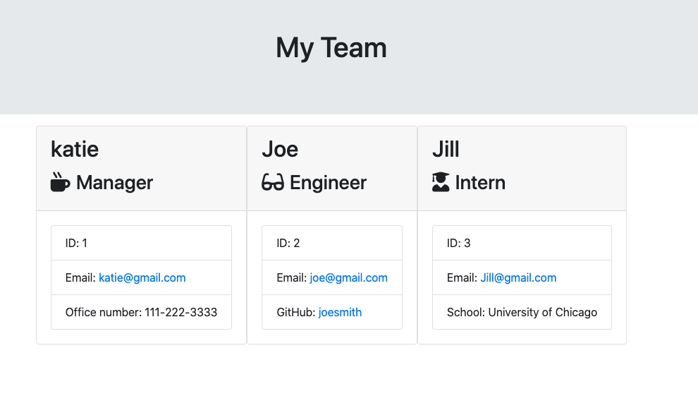

# Team Generator

## Goals
- The goal of this project was to gather the information of a team using inquirer
- Ideally, it saves the manager some time creating a team page and they are quickly able ot input who is in their team without having to write so much html or manually input ALL the information.

## Process
- In order to do this, I first had to create a base class which was the general 'Employee' class. After that I was able to create files which, based on user input, would switch depending on if they chose "Manager", "Engineer", or "Intern" because each individual role had a separate question. 
- Once that was done, I had to make sure that the input would be taken into a method of storage (the array: employees). 
- Then, I was able to push this information to an html file which collects all the data and displays it on the page. 

## Technology Used
- Inquirer (via NPM)
- node.js
- Jest (via NPM)
- Javascript

## Issues
- I know there is definitely quite a bit of repetition in the code that could be simplified but it was difficult for me to figure out how I could cut some of it out. 
